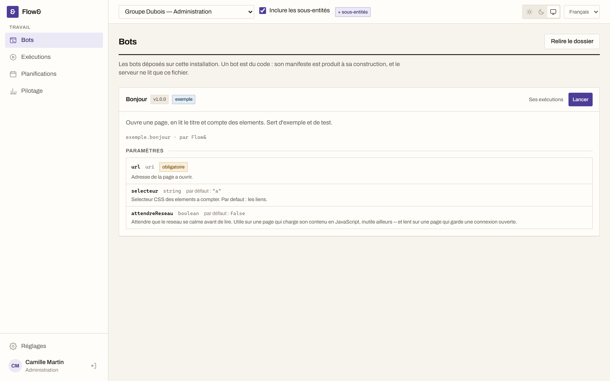
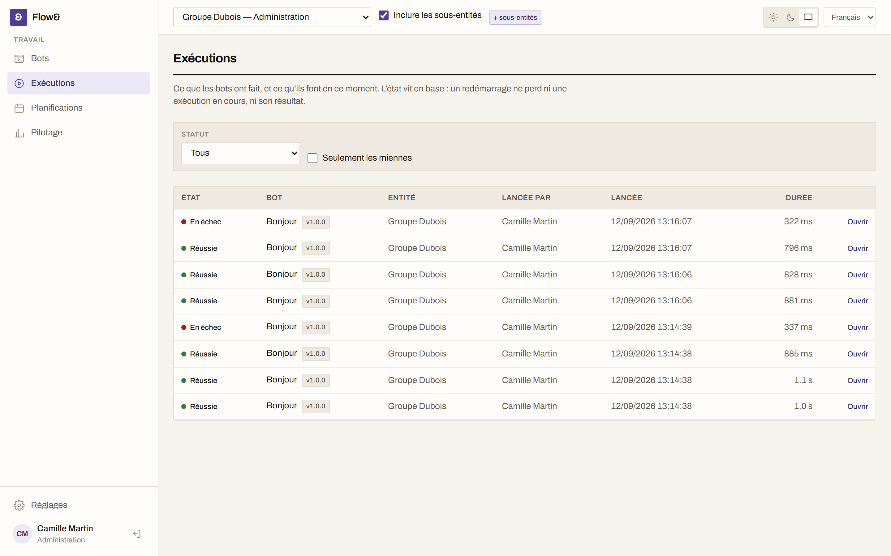
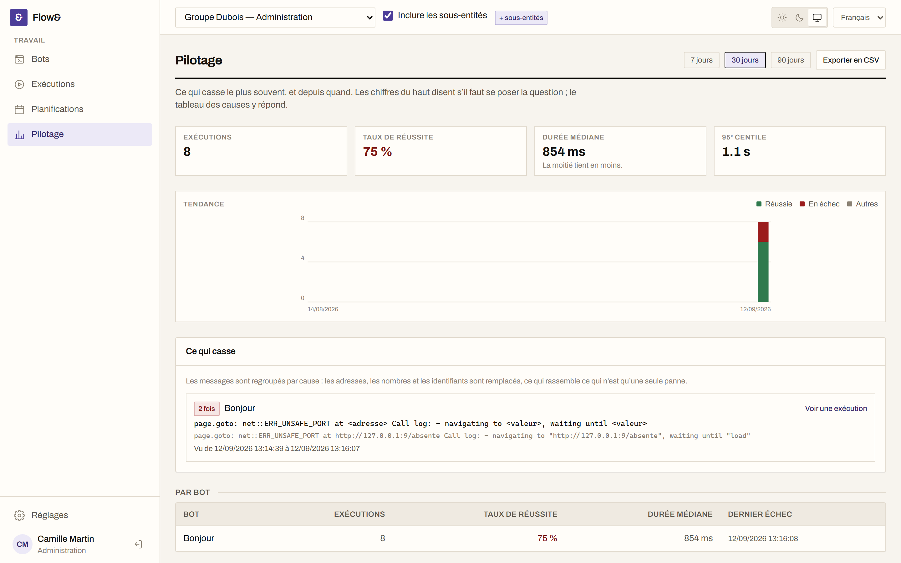
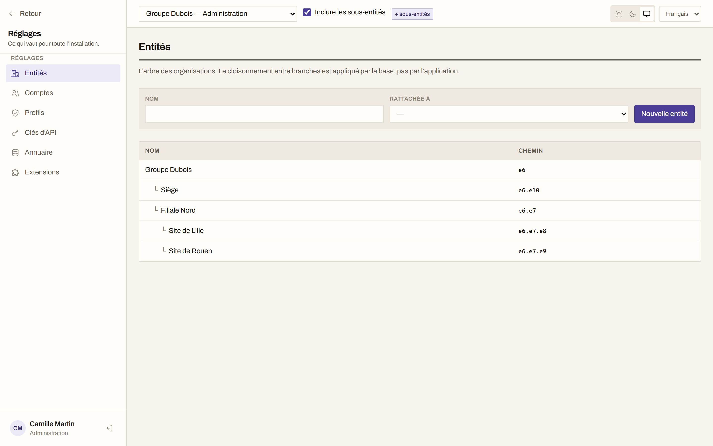

[English](README.md) · **Français**

# Flow&

**Automatisation navigateur libre et auto-hébergeable.** Des bots écrits en TypeScript, exécutés
pour le compte de toute une organisation, avec le journal, la progression et la vue en direct de ce
qu'ils font — et une trace de ce qui s'est passé quand ils cassent.

[](LICENSE)
[](https://github.com/tick0001/flow/actions/workflows/ci.yml)

Membre de la collection **tick&**, aux côtés de [Tick&](https://tickand.fr), outil de ticketing
ITSM, dont Flow& reprend la pile technique, les conventions et l'écriture visuelle.



---

## Ce que ça fait

**Un bot est du code.** Des métadonnées, un schéma de paramètres, et une fonction qui reçoit une
page Playwright authentique — pas une façade appauvrie. Le formulaire de lancement est déduit du
schéma, si bien que le serveur valide exactement ce que l'interface a affiché. Voir le
[SDK de bots](docs/15-sdk-bots.md).

**Les navigateurs tournent dans un worker séparé.** L'API n'en lance jamais un : elle crée la trace,
publie le travail, rend la main. Un Chromium qui meurt n'emporte pas l'interface, un redémarrage ne
perd pas une exécution en cours, et la charge s'encaisse en ajoutant des workers.

**On voit ce qui se passe.** Journal horodaté persisté au fil de l'eau, progression, et vue en
direct du navigateur par screencast CDP — relayée aux seuls abonnés, jamais poussée dans un circuit
permanent par utilisateur. Une coupure réseau reprend là où elle s'est arrêtée, sans perdre ni
dupliquer une ligne.



**Le pilotage répond à une question : qu'est-ce qui casse, et depuis quand.** Les messages d'échec
sont regroupés **par cause** — adresses, nombres et identifiants remplacés — ce qui ramène deux
cents lignes uniques aux trois pannes qu'elles sont. La période s'exporte en CSV.



**Multi-organisation, appliqué par la base.** Les entités forment un arbre, et le cloisonnement
repose sur le Row-Level Security de PostgreSQL — pas sur des conditions `WHERE` que l'on peut
oublier d'écrire. Un droit est un triplet objet × action × portée, et l'absence de ligne vaut refus.



**Lancé autrement qu'à la main.** Par expression cron avec fuseau, ou par une clé d'API depuis une
chaîne d'intégration. Voir [planification et API](docs/19-planification-et-api.md).

**Extensible sans forker.** Un plugin obtient son propre schéma PostgreSQL, déclare ses droits,
accroche le lancement des bots, s'abonne aux événements, remplit des emplacements d'interface, pose
des tâches de fond — et se désinstalle sans laisser de trace. Ses tables héritent du cloisonnement
du cœur, par la même fonction PostgreSQL. Voir le [SDK de plugins](docs/21-plugins.md).

**Comptes d'annuaire LDAP / Active Directory**, avec des règles d'affectation groupe → profil +
entité. La base locale est interrogée d'abord, toujours : un compte d'administration de secours
n'est jamais bloqué par un annuaire injoignable.

**Français et anglais**, dans l'interface comme dans les messages du serveur.

## Déployer

```bash
git clone https://github.com/tick0001/flow.git && cd flow
cp docker/production.env.example docker/.env   # puis remplir : secrets, adresses
docker compose -f docker/compose.production.yaml up -d

# Créer le premier administrateur — sans lui, personne ne peut se connecter.
docker compose -f docker/compose.production.yaml run --rm \
  -e FLOW_ADMIN_PASSWORD='…' api node apps/api/dist/cli/initialiser.js
```

Le fichier d'environnement va dans `docker/`, à côté du fichier compose : c'est là que Compose le
cherche, et non à la racine du dépôt. `make` en donne les raccourcis (`make prod`, `make prod-admin`,
`make prod-migrer`).

Les images sont tirées de `ghcr.io/tick0001/flow-api`, `-worker`, `-web` et `-migrations`. Épingler
une version avec les variables `FLOW_IMAGE_*` plutôt que suivre `latest`, pour qu'une montée de
version reste une décision.

Flow& attend derrière un terminateur TLS — Caddy, Traefik, nginx — qui présente le certificat :
l'interface n'écoute que sur la boucle locale par défaut.

Le [guide d'installation](docs/23-installation.md) détaille les secrets à générer, la rotation
**obligatoire** du mot de passe du rôle applicatif, les sauvegardes et les montées de version. Il a
été écrit en installant, et la sauvegarde comme la restauration y ont été éprouvées : base et volume
effacés, puis restaurés, et la capture d'une exécution antérieure resservie à l'identique.

Pas de conteneurs autorisés sur vos serveurs ? Le même guide couvre le déploiement depuis les
[archives de version](https://github.com/tick0001/flow/releases), sur Linux (systemd + nginx) comme
sur Windows Server.

## Essayer en local

Prérequis : Node 22 ou plus, pnpm 11, Docker.

```bash
pnpm install
cp .env.example .env
pnpm services:up      # PostgreSQL, Redis et OpenLDAP, sur des ports décalés
pnpm db:migrate       # schéma, déclencheurs, politiques RLS
pnpm navigateurs      # Chromium, pour le worker — une seule fois
FLOW_ADMIN_PASSWORD="choisissez-en-un-vrai" pnpm db:init
pnpm dev              # API :3100, interface :5273, worker
```

Puis <http://localhost:5273>. La première connexion impose un changement de mot de passe.

Quatre bots sont déjà déposés dans [`bots/`](bots/) : construisez-les (`pnpm build`), ouvrez
**Bots**, et lancez-les. Aucun ne prend d'adresse — leurs paramètres sont des listes fermées, et
`exemple-bonjour` ne sort même pas de la machine. Voir [le SDK](docs/15-sdk-bots.md).

Le worker installe ses navigateurs à part, et jamais au démarrage : une application qui télécharge
Chromium au premier lancement transforme une panne de proxy d'entreprise en application qui ne
démarre pas.

Les ports sont décalés — 5433, 6380, 3100, 5273 — pour que Flow& et les autres projets de la
collection tournent côte à côte.

## Où en est le projet

Les onze jalons de la [feuille de route](docs/06-feuille-de-route.md) sont livrés. La suite fait
275 tests — dont des tests d'intégration sur une vraie base PostgreSQL qui vérifient l'isolation
entre entités — plus 12 parcours de bout en bout joués dans un vrai navigateur contre la vraie API :
connexion, cloisonnement, cycle de vie d'une exécution, planification. L'API compte 58 opérations,
décrites par une description OpenAPI déduite des contrôleurs.

Ce qu'il faut savoir avant de s'en servir, dit franchement :

- **Jamais utilisé en production par personne.** Le chemin d'installation en conteneurs a été
  déroulé sur une machine vierge, et les quatre défauts rencontrés corrigés dans le code — mais
  aucune organisation n'a encore fait tourner de vrais bots avec Flow&.
- **Les chemins d'installation sans conteneur n'ont pas été déroulés**, ni sous Linux ni sous
  Windows Server. Un blocage y est attendu : le
  [gabarit d'anomalie](.github/ISSUE_TEMPLATE/installation.yml) est fait pour ça.
- **`0.1.0` est une première version, pas une version éprouvée.** Attendez-vous à des ruptures entre
  versions mineures tant que les interfaces n'auront pas été exercées par quelqu'un d'autre que leur
  auteur.
- **Les deux SDK restent en `0.x`** et peuvent rompre entre deux versions mineures.
- **Un plugin s'exécute dans le processus de l'API, avec ses privilèges.** Il n'y a pas de bac à
  sable : l'installer engage autant que déployer une version. [La note du jalon](docs/21-plugins.md)
  le dit avant tout le reste.

Les retours, les rapports d'anomalie et les bots d'essai sont donc utiles maintenant — voir
[CONTRIBUTING](CONTRIBUTING.md). Les failles se signalent en privé, jamais par une issue publique :
[SECURITY](SECURITY.md).

## Développer

```bash
make             # la liste des cibles
make verifier    # mise en forme, SVG, lint, types et tests
pnpm build       # construit tous les paquets
pnpm test        # 275 tests — nécessite les services démarrés
pnpm lint        # ESLint avec règles typées
pnpm typecheck   # vérification de types sans émission
pnpm format      # applique Prettier
pnpm db:reset    # repart d'une base vierge et migrée
make parcours    # 12 parcours de bout en bout, dans un navigateur
pnpm openapi     # exporte la description de l'API
```

L'intégration continue lance exactement cela. Un échec local est un échec distant.

Le monorepo réunit l'API (NestJS), l'interface (React + Vite), le worker d'exécution, et six paquets
partagés : contrats Zod, couche de données Drizzle, traductions, stockage, SDK de bots, SDK de
plugins.

Le bot de référence `bots/exemple-bonjour` et le plugin de référence `plugins/exemple-carnet`
exercent chaque point d'extension et servent de tests d'intégration permanents.

Commits en français, courts, préfixés d'un gitmoji : `:sparkles: ajoute l'arbre des entités`.

## Choix structurants

| Sujet              | Décision                                                      |
| ------------------ | ------------------------------------------------------------- |
| Backend            | NestJS (TypeScript)                                           |
| Exécution          | Worker séparé, Playwright, file BullMQ sur Redis              |
| Base de données    | PostgreSQL — `ltree`, `jsonb`, `tsvector`, Row-Level Security |
| Accès aux données  | Drizzle ORM, schéma découpé par module                        |
| Frontend           | React + Vite, Tailwind, TanStack Query & Table                |
| Temps réel         | Redis pub/sub relayé en SSE, screencast CDP                   |
| Extensions         | Modules ESM, manifeste versionné, deux SDK en semver propre   |
| Multi-organisation | Entités hiérarchiques + Row-Level Security PostgreSQL         |
| Déploiement        | Auto-hébergé, Docker Compose, et hors conteneurs              |
| Authentification   | Locale + LDAP / Active Directory                              |

Chacune est argumentée dans [le document d'architecture](docs/02-architecture.md), qui dit aussi ce
que l'outil remplacé payait à leur place.

## API

La description OpenAPI est servie par l'application elle-même, sans authentification :

```
GET /api/openapi.json
```

Elle est **déduite** des contrôleurs et des schémas qu'ils valident : elle ne peut ni omettre une
route existante, ni en décrire une disparue, et un test le vérifie contre le routeur. Chaque
opération porte le droit qu'elle exige.

## Documentation

| Document                                                          | Contenu                                                       |
| ----------------------------------------------------------------- | ------------------------------------------------------------- |
| [Périmètre fonctionnel](docs/01-perimetre-fonctionnel.md)         | Ce que Flow& couvre, et ce qu'il laisse dehors                |
| [Architecture](docs/02-architecture.md)                           | Monorepo, API, worker, interface, décisions argumentées       |
| [Entités, droits et sécurité](docs/03-entites-droits-securite.md) | Le modèle multi-organisation et son application par RLS       |
| [SDK de bots](docs/15-sdk-bots.md)                                | Écrire un bot : métadonnées, schéma, contexte d'exécution     |
| [Cycle d'une exécution](docs/16-cycle-d-execution.md)             | De la demande au résultat, interruption et reprise comprises  |
| [Temps réel](docs/17-temps-reel.md)                               | Journal, progression, vue en direct, reprise après coupure    |
| [Historique et stockage](docs/18-historique-et-stockage.md)       | Captures, traces, rétention et purge                          |
| [Planification et API](docs/19-planification-et-api.md)           | Expressions cron, fuseaux, clés d'API, description OpenAPI    |
| [Pilotage](docs/20-pilotage.md)                                   | Taux de réussite, durées, signature des échecs, export CSV    |
| [Plugins](docs/21-plugins.md)                                     | Manifeste, droits, hooks, événements, schéma dédié, retrait   |
| [Annuaire et parcours](docs/22-annuaire-et-parcours.md)           | LDAP / AD, règles d'affectation, tests de bout en bout        |
| [Droits des bots](docs/24-droits-des-bots.md)                     | Qui peut lancer quoi, et où : règles par entité et par profil |
| [Interface](docs/12-interface.md)                                 | Jetons de couleur, navigation, briques communes               |
| [Installation et exploitation](docs/23-installation.md)           | Conteneurs, Linux, Windows Server, sauvegardes, montées       |
| [Journal des versions](CHANGELOG.md)                              | Ce que chaque version change, et ce qu'elle exige de vous     |
| [Feuille de route](docs/06-feuille-de-route.md)                   | Onze jalons, du socle à la publication                        |

## Licence

**AGPL-3.0-or-later** — voir [LICENSE](LICENSE).

Copyleft avec clause réseau : quiconque héberge une version modifiée de Flow& doit publier ses
modifications, même sans distribuer le code.

Pas d'exception de liaison : un plugin est chargé dans le processus de l'API et est très
probablement une œuvre dérivée de celui-ci, donc soumis à la même licence. À lire avant d'écrire un
plugin propriétaire.

> Nom : **Flow&** — identifiant technique partout ailleurs : `flow` (paquets `@flow/*`, images
> Docker, schémas SQL, préfixes d'API).
