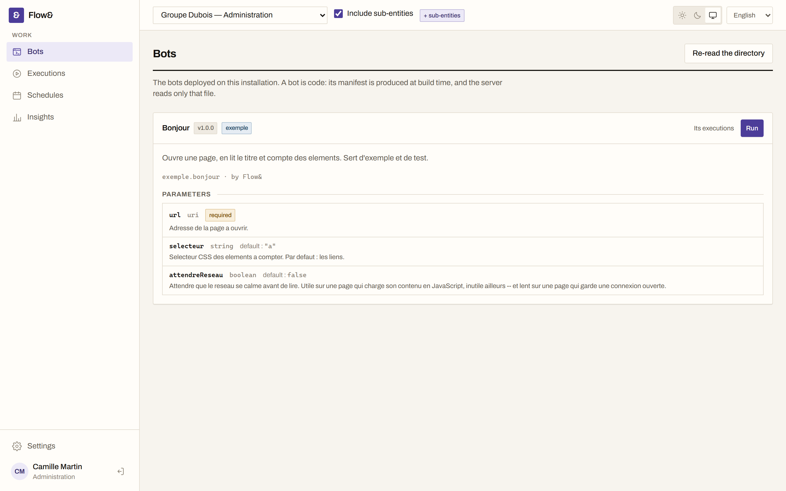
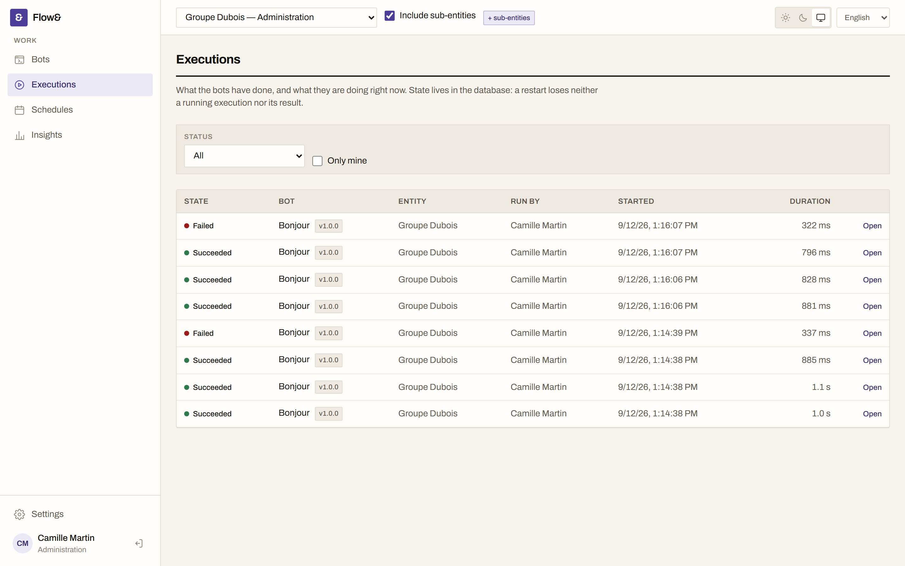
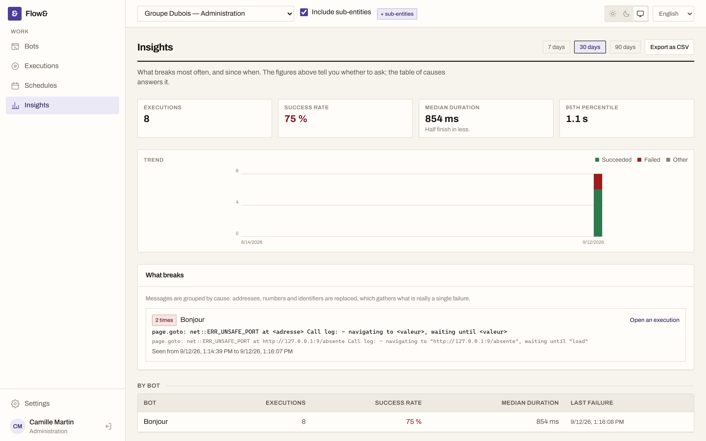
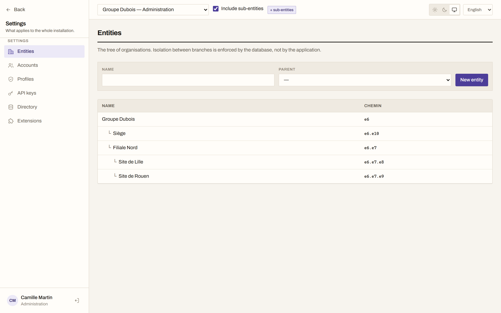

**English** · [Français](README.fr.md)

# Flow&

**Open-source, self-hosted browser automation.** Bots written in TypeScript, run on behalf of a
whole organisation, with the log, the progress and the live view of what they are doing — and a
trace of what happened when they break.

[](LICENSE)
[](https://github.com/tick0001/flow/actions/workflows/ci.yml)

Part of the **tick&** collection, alongside [Tick&](https://tickand.fr), an ITSM service desk, whose
stack, conventions and visual writing Flow& shares.



---

## What it does

**A bot is code.** Metadata, a parameter schema, and a function that receives a genuine Playwright
page — not a thinned-out façade. The launch form is derived from the schema, so the server validates
exactly what the interface displayed. See the [bot SDK](docs/15-sdk-bots.md).

**Browsers run in a separate worker.** The API never launches one: it records the run, publishes the
job, returns. A Chromium that dies does not take the interface with it, a restart does not lose a
run in flight, and load is absorbed by adding workers.

**You can see what is happening.** Timestamped log persisted as it goes, progress, and a live view of
the browser over CDP screencast — relayed to subscribers only, never pushed into a permanent
per-user channel. A dropped connection resumes where it left off, losing and duplicating nothing.



**Insights answer one question: what breaks, and since when.** Failure messages are grouped **by
cause** — addresses, numbers and identifiers replaced — which reduces two hundred unique lines to
the three faults they are. The period exports to CSV.



**Multi-organisation, enforced by the database.** Entities form a tree, and isolation rests on
PostgreSQL Row-Level Security — not on `WHERE` clauses one can forget to write. A right is an
object × action × scope triple, and a missing row means refusal.



**Started other than by hand.** By cron expression with a time zone, or by an API key from an
integration pipeline. See [scheduling and API](docs/19-planification-et-api.md).

**Extensible without forking.** A plugin gets its own PostgreSQL schema, declares its rights, hooks
into bot launches, subscribes to events, fills interface slots, schedules background work — and
uninstalls without leaving a trace. Its tables inherit the core's isolation, through the same
PostgreSQL function. See the [plugin SDK](docs/21-plugins.md).

**LDAP / Active Directory accounts**, with group → profile + entity assignment rules. The local
database is queried first, always: a break-glass administration account is never locked out by an
unreachable directory.

**French and English**, in the interface as in server messages.

## Deploy

```bash
git clone https://github.com/tick0001/flow.git && cd flow
cp docker/production.env.example docker/.env   # then fill in: secrets, addresses
docker compose -f docker/compose.production.yaml up -d

# Create the first administrator — without it, nobody can sign in.
docker compose -f docker/compose.production.yaml run --rm \
  -e FLOW_ADMIN_PASSWORD='…' api node apps/api/dist/cli/initialiser.js
```

The environment file goes in `docker/`, next to the compose file: that is where Compose looks for
it, not at the root of the repository. `make` holds the shortcuts (`make prod`, `make prod-admin`,
`make prod-migrer`).

Images are pulled from `ghcr.io/tick0001/flow-api`, `-worker`, `-web` and `-migrations`. Pin a
version with the `FLOW_IMAGE_*` variables rather than following `latest`, so that upgrading stays a
decision.

Flow& expects a TLS terminator in front — Caddy, Traefik, nginx — presenting the certificate: the
interface listens on the loopback only by default.

The [installation guide](docs/23-installation.md) covers the secrets to generate, the **mandatory**
rotation of the application role's password, backups and upgrades. It was written while installing,
and both backup and restore were proven there: database and volume wiped, then restored, and the
screenshot of an earlier execution served again unchanged.

Containers not allowed on your servers? The same guide covers deployment from the
[release archives](https://github.com/tick0001/flow/releases), on Linux (systemd + nginx) and on
Windows Server.

## Try it locally

Requirements: Node 22 or later, pnpm 11, Docker.

```bash
pnpm install
cp .env.example .env
pnpm services:up      # PostgreSQL, Redis and OpenLDAP, on shifted ports
pnpm db:migrate       # schema, triggers, RLS policies
pnpm navigateurs      # Chromium, for the worker — once
FLOW_ADMIN_PASSWORD="pick-a-real-one" pnpm db:init
pnpm dev              # API :3100, interface :5273, worker
```

Then <http://localhost:5273>. The first sign-in forces a password change.

A reference bot is already dropped in [`bots/`](bots/exemple-bonjour): build it (`pnpm build`), open
**Bots**, and run it against an address of your choice.

The worker installs its browsers separately, and never at startup: an application that downloads
Chromium on first launch turns a corporate proxy outage into an application that will not start.

Ports are shifted — 5433, 6380, 3100, 5273 — so that Flow& and the other projects in the collection
run side by side.

## Where the project stands

The eleven milestones of the [roadmap](docs/06-feuille-de-route.md) are delivered. The suite is 275
tests — including integration tests against a real PostgreSQL database that check isolation between
entities — plus 12 end-to-end journeys run in a real browser against the real API: sign-in,
isolation, execution lifecycle, scheduling. The API has 58 operations, described by an OpenAPI
document derived from the controllers.

What you should know before using it, said plainly:

- **Never used in production by anyone.** The container installation path was walked on a clean
  machine, and the four defects found were fixed in the code — but no organisation has yet run real
  bots with Flow&.
- **The container-free installation paths have not been walked**, neither on Linux nor on Windows
  Server. A blocker there is expected: the
  [issue template](.github/ISSUE_TEMPLATE/installation.yml) exists for that.
- **`0.1.0` is a first release, not a proven one.** Expect breaking changes between minor versions
  until the interfaces have been exercised by someone other than their author.
- **Both SDKs remain at `0.x`** and may break between minor versions.
- **A plugin runs inside the API process, with its privileges.** There is no sandbox: installing one
  commits as much as deploying a release. [The milestone note](docs/21-plugins.md) says so before
  anything else.

Feedback, bug reports and trial bots are therefore useful now — see [CONTRIBUTING](CONTRIBUTING.md).
Vulnerabilities are reported privately, never through a public issue: [SECURITY](SECURITY.md).

## Develop

```bash
make             # the list of targets
make verifier    # formatting, SVG, lint, types and tests
pnpm build       # builds every package
pnpm test        # 275 tests — requires the services running
pnpm lint        # ESLint with typed rules
pnpm typecheck   # type checking without emit
pnpm format      # applies Prettier
pnpm db:reset    # start again from a clean, migrated database
make parcours    # 12 end-to-end journeys, in a browser
pnpm openapi     # exports the API description
```

Continuous integration runs exactly that. A local failure is a remote failure.

The monorepo holds the API (NestJS), the interface (React + Vite), the execution worker, and six
shared packages: Zod contracts, Drizzle data layer, translations, storage, bot SDK, plugin SDK.

The reference bot `bots/exemple-bonjour` and the reference plugin `plugins/exemple-carnet` exercise
every extension point and act as permanent integration tests.

Commits in French, short, prefixed with a gitmoji: `:sparkles: ajoute l'arbre des entités`.

## Structural choices

| Topic              | Decision                                                      |
| ------------------ | ------------------------------------------------------------- |
| Backend            | NestJS (TypeScript)                                           |
| Execution          | Separate worker, Playwright, BullMQ queue on Redis            |
| Database           | PostgreSQL — `ltree`, `jsonb`, `tsvector`, Row-Level Security |
| Data access        | Drizzle ORM, schema split by module                           |
| Frontend           | React + Vite, Tailwind, TanStack Query & Table                |
| Real time          | Redis pub/sub relayed over SSE, CDP screencast                |
| Extensions         | ESM modules, versioned manifest, two SDKs on clean semver     |
| Multi-organisation | Hierarchical entities + PostgreSQL Row-Level Security         |
| Deployment         | Self-hosted, Docker Compose, and without containers           |
| Authentication     | Local + LDAP / Active Directory                               |

Each one is argued in [the architecture document](docs/02-architecture.md), which also says what the
tool being replaced paid in their place.

## API

The OpenAPI description is served by the application itself, without authentication:

```
GET /api/openapi.json
```

It is **derived** from the controllers and the schemas they validate: it can neither omit an
existing route nor describe one that is gone, and a test checks it against the router. Every
operation carries the right it requires.

## Documentation

| Document                                                            | Contents                                                    |
| ------------------------------------------------------------------- | ----------------------------------------------------------- |
| [Functional scope](docs/01-perimetre-fonctionnel.md)                | What Flow& covers, and what it leaves out                   |
| [Architecture](docs/02-architecture.md)                             | Monorepo, API, worker, interface, argued decisions          |
| [Entities, rights and security](docs/03-entites-droits-securite.md) | The multi-organisation model and its enforcement by RLS     |
| [Bot SDK](docs/15-sdk-bots.md)                                      | Writing a bot: metadata, schema, execution context          |
| [Execution lifecycle](docs/16-cycle-d-execution.md)                 | From request to result, cancellation and recovery included  |
| [Real time](docs/17-temps-reel.md)                                  | Log, progress, live view, resume after a dropped connection |
| [History and storage](docs/18-historique-et-stockage.md)            | Screenshots, traces, retention and purge                    |
| [Scheduling and API](docs/19-planification-et-api.md)               | Cron expressions, time zones, API keys, OpenAPI description |
| [Insights](docs/20-pilotage.md)                                     | Success rate, durations, failure signature, CSV export      |
| [Plugins](docs/21-plugins.md)                                       | Manifest, rights, hooks, events, dedicated schema, removal  |
| [Directory and journeys](docs/22-annuaire-et-parcours.md)           | LDAP / AD, assignment rules, end-to-end tests               |
| [Interface](docs/12-interface.md)                                   | Colour tokens, navigation, shared building blocks           |
| [Installation and operation](docs/23-installation.md)               | Containers, Linux, Windows Server, backups, upgrades        |
| [Changelog](CHANGELOG.md)                                           | What each release changes, and what it requires of you      |
| [Roadmap](docs/06-feuille-de-route.md)                              | Eleven milestones, from the groundwork to publication       |

## Licence

**AGPL-3.0-or-later** — see [LICENSE](LICENSE).

Copyleft with a network clause: anyone hosting a modified version of Flow& must publish their
modifications, even without distributing the code.

No linking exception: a plugin is loaded into the API process and is very probably a derivative work
of it, hence subject to the same licence. Read this before writing a proprietary plugin.

> Name: **Flow&** — technical identifier everywhere else: `flow` (`@flow/*` packages, Docker images,
> SQL schemas, API prefixes).
